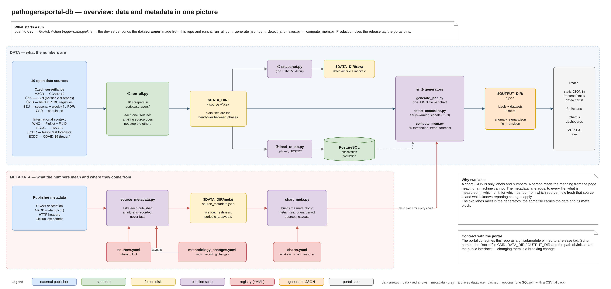

# pathogensportal-db

The data pipeline behind [Pathogen Portal CZ](https://pathogens.vm.cesnet.cz/). It downloads open
epidemiological data, archives every download, normalises it into PostgreSQL and generates the
Chart.js JSON files that the portal's dashboards read.

The repository is separate on purpose: the portal is a static website, and this repository is
everything that moves around the data. The portal consumes it as a git submodule pinned to a
release tag — see [Contract with the portal](#contract-with-the-portal).



## Quick start

Locally (Python 3.12):

```bash
pip install -r requirements.txt
cp .env.example .env                  # optional, the defaults work

python scripts/run_all.py             # download CSVs into $DATA_DIR, snapshot them, collect source metadata
python scripts/load_to_db.py          # optional: fill PostgreSQL
python scripts/generate_json.py       # chart JSON into $OUTPUT_DIR
python scripts/detect_anomalies.py    # $OUTPUT_DIR/anomaly_signals.json
python scripts/compute_mem.py         # $OUTPUT_DIR/flu_mem.json
python scripts/compute_nowcast.py     # $OUTPUT_DIR/flu_nowcast.json (shadow mode)
```

In Docker:

```bash
docker build -t pathogensportal-db .
docker run --rm -v "$PWD/data:/data" -v "$PWD/out/charts:/output/charts" pathogensportal-db
```

The container runs `run_all.py → generate_json.py → detect_anomalies.py → compute_mem.py →
compute_nowcast.py`; the last step may fail without stopping the others.
`load_to_db.py` is not part of that command; without a database `generate_json.py` reads the CSV
files directly.

## Pipeline at a glance

The phases hand over through the file system, not through shared state. Each one can be run on its
own and is idempotent — a repeated run neither duplicates nor breaks anything.

| # | Phase | Script | Writes |
|---|---|---|---|
| 1 | Download | `scripts/run_all.py` → `scripts/scrapers/*.py` | `$DATA_DIR/<source>/*.csv` |
| 2 | Archive | `scripts/snapshot.py` (called by `run_all.py`) | `$DATA_DIR/raw/<date>/…csv.gz`, `raw/manifest.json` |
| 2b | Source metadata | `scripts/source_metadata.py` (called by `run_all.py`) | `$DATA_DIR/meta/source_metadata.json` |
| 3 | Normalise | `scripts/load_to_db.py` | PostgreSQL tables `observation`, `population` |
| 4 | Charts | `scripts/generate_json.py` | `$OUTPUT_DIR/*.json` (Chart.js data + `meta` block) |
| 5 | Analytics | `scripts/detect_anomalies.py` | `$OUTPUT_DIR/anomaly_signals.json` |
|   |           | `scripts/compute_mem.py` | `$OUTPUT_DIR/flu_mem.json` |

Every scraper runs in isolation: when one source fails (site down, format changed) the others
finish, and `run_all.py` lists what failed and exits with code 1.

The pipeline writes JSON only. It does not write any Hugo pages.

## Data sources

| Source | What we take | Scraper |
|---|---|---|
| **MZČR** — COVID-19 open data | cases, hospitalisations, tests, incidence, deaths, vaccination status, per-person age and region | `mzcr_covid.py` |
| **ÚZIS ISIN** | notifiable infectious diseases: 114 diagnoses by region, month and age group | `uzis_isin.py` |
| **ÚZIS registries RPN, RTBC** | sexually transmitted infections (since 1994) and tuberculosis (since 2000) — these are not in ISIN | `uzis_registries.py` |
| **SZÚ** — seasonal archives | influenza / ARI season summaries since 2012/13 | `szu_influenza.py` |
| **SZÚ** — weekly PDFs | virus × week matrix and weekly reports by region | `szu_weekly.py` |
| **ČSÚ** | population by region — the denominators for incidence | `csu_population.py` |
| **WHO FluNet + FluID** | weekly influenza lab detections with specimens tested; ILI/ARI cases with population covered | `who_flu.py` |
| **ECDC ERVISS** | weekly ILI/ARI rates per 100,000 and lab reports for Czechia | `ecdc_erviss.py` |
| **ECDC RespiCast** | weekly probabilistic ILI/ARI forecasts | `ecdc_respicast.py` |
| **ECDC COVID-19** | historical daily series, frozen since autumn 2022 | `ecdc_covid.py` |

Details, file formats and known limits of each source: [docs/data-sources.md](docs/data-sources.md).

## Repository layout

```
scripts/run_all.py             runs every scraper, then the snapshot and the source metadata
scripts/scrapers/              one module per source
scripts/snapshot.py            dated gzip snapshots with sha256 de-duplication
scripts/source_metadata.py     metadata from the publishers (licence, freshness) → data/meta/
scripts/load_to_db.py          ETL: CSV → PostgreSQL (observation, population)
scripts/generate_json.py       reads the data, writes Chart.js JSON into $OUTPUT_DIR
scripts/chart_meta.py          the `meta` block attached to every chart
scripts/detect_anomalies.py    anomaly detection (Farrington/Noufaily) → anomaly_signals.json
scripts/simulate_detection.py  simulation study of the detector
scripts/compute_mem.py         seasonal influenza thresholds → flu_mem.json
scripts/mem.py                 Moving Epidemic Method — the computation, no I/O
scripts/trend.py               growth / decline category of the current wave
scripts/forecast.py            threshold exceedance probability from quantile forecasts
scripts/compute_nowcast.py     nowcast of weekly lab detections → flu_nowcast.json
scripts/nowcast.py             reporting triangle and chain-ladder — the computation, no I/O
sources.yaml                   source registry — where to find each publisher's metadata
charts.yaml                    what each chart measures: source, metric, unit, grain
methodology_changes.yaml       registry of reporting changes; the source of chart `caveats`
curated/szu/                   closed SZÚ seasons whose online source no longer exists
db/init.sql                    PostgreSQL schema (the portal mounts it into its database container)
tests/                         pytest suite, runs without network access
docs/                          documentation and diagrams
Dockerfile                     the `datascrapper` image — the portal builds it from this repo
requirements.txt               Python dependencies (the only source of them)
.env.example                   template of the environment variables
```

## Configuration

| Variable | Default | Meaning |
|---|---|---|
| `DATA_DIR` | `./data` | where the scrapers store downloads and the later phases read them |
| `OUTPUT_DIR` | `./site/static/data/charts` | where the generated JSON is written |
| `DB_HOST` | `localhost` | database for `load_to_db.py` and for the SQL path of `generate_json.py` |
| `DB_PORT` | `5432` | |
| `POSTGRES_DB` | `pathogens` | |
| `POSTGRES_USER` | `portal` | |
| `POSTGRES_PASSWORD` | `portal_dev` | local development only — production takes it from the portal's secrets |
| `DB_CONNECT_TIMEOUT` | `3` | seconds `generate_json.py` waits before it falls back to the CSV files |
| `GITHUB_TOKEN` | unset | optional; lifts the 60 requests/hour limit of the GitHub API used by `ecdc_respicast.py` |

Relative defaults are resolved against the repository root. In the container `DATA_DIR=/data` and
`OUTPUT_DIR=/output/charts`.

## Contract with the portal

The portal (`pathogensportal`) takes this repository as a **git submodule pinned to a release tag**
— not to a branch, otherwise every push here would change what runs in production — and builds the
`datascrapper` image from it. In practice this makes the following the public interface of the
repository:

- the script names `run_all.py`, `generate_json.py`, `detect_anomalies.py`, `compute_mem.py`,
  `compute_nowcast.py`
- the `CMD` of the Dockerfile
- the variable names `DATA_DIR` and `OUTPUT_DIR`
- the path `db/init.sql`
- the names and the shape of the generated JSON files

Changing any of them is a breaking change. It needs a new release and a line in the release notes,
not a quiet push to `dev`.

New data reaches the portal only when the **submodule pin moves to a new tag**. Cutting a release
here does not change the portal by itself. See [docs/deployment.md](docs/deployment.md).

## Documentation

| Document | Content |
|---|---|
| [docs/architecture.md](docs/architecture.md) | the phases, the design principles, all three diagrams |
| [docs/data-sources.md](docs/data-sources.md) | every source and its scraper: what is downloaded, how it is checked, what comes out |
| [docs/snapshots.md](docs/snapshots.md) | the dated archive and why it exists |
| [docs/data-model.md](docs/data-model.md) | the PostgreSQL schema and what each loader writes |
| [docs/chart-generation.md](docs/chart-generation.md) | how a CSV becomes a chart JSON; catalogue of every generated file |
| [docs/metadata.md](docs/metadata.md) | source metadata, `charts.yaml`, the `meta` block |
| [docs/analytics/anomaly-detection.md](docs/analytics/anomaly-detection.md) | the early-warning system on ISIN |
| [docs/analytics/flu-mem.md](docs/analytics/flu-mem.md) | seasonal influenza thresholds, trend and forecast |
| [docs/HOLDOUT.md](docs/HOLDOUT.md) | validation episodes that must not be used during development |
| [docs/deployment.md](docs/deployment.md) | Docker image, the dev-server trigger, releases, the submodule pin |
| [docs/development.md](docs/development.md) | tests, adding a source or a chart, branch and PR conventions |
| [docs/diagrams/](docs/diagrams/) | draw.io sources and PNG exports of the flowcharts |
| [CHANGELOG.md](CHANGELOG.md) | what changed in each release |

## Tests

```bash
pip install pytest
pytest -q
```

The suite needs no network and no database. CI runs it on every push and pull request.
