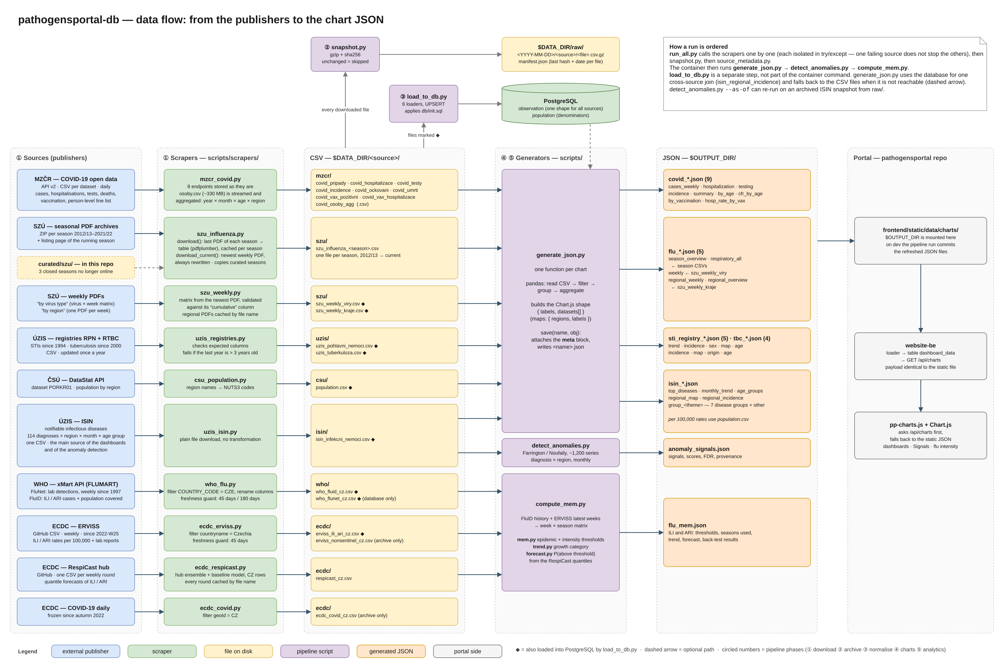

# Data sources and scrapers

Every source has one scraper module in `scripts/scrapers/`. All of them have the same shape:

```python
def download(output_dir: Path) -> list[str]:
    """Download, validate, write CSV files into output_dir, return their paths."""
```

`scripts/run_all.py` calls them one after another, each inside `try/except`. The returned paths
are handed to `snapshot.py`, so everything a scraper reports is archived. A scraper can also be run
alone, for example `python scripts/scrapers/uzis_isin.py`.

The diagram shows which scraper produces which file and who reads it:



## Summary

| Source | Scraper | Output in `$DATA_DIR` | Grain | In PostgreSQL | Read by |
|---|---|---|---|---|---|
| MZČR COVID-19 | `mzcr_covid.py` | `mzcr/covid_*.csv` (9 files) | day; month × age × region | no | `generate_json.py` |
| ÚZIS ISIN | `uzis_isin.py` | `isin/isin_infekcni_nemoci.csv` | month × region × age × diagnosis | yes | `generate_json.py`, `detect_anomalies.py` |
| ÚZIS RPN + RTBC | `uzis_registries.py` | `uzis/uzis_pohlavni_nemoci.csv`, `uzis/uzis_tuberkuloza.csv` | year (TB: quarter) | yes | `generate_json.py` |
| SZÚ seasonal | `szu_influenza.py` | `szu/szu_influenza_<season>.csv` | season total per virus | no | `generate_json.py` |
| SZÚ weekly | `szu_weekly.py` | `szu/szu_weekly_viry.csv`, `szu/szu_weekly_kraje.csv` | week | yes | `generate_json.py` |
| ČSÚ | `csu_population.py` | `csu/population.csv` | year × region × sex | yes | `generate_json.py` |
| WHO FluNet + FluID | `who_flu.py` | `who/who_flunet_cz.csv`, `who/who_fluid_cz.csv` | week | yes | `generate_json.py` (FluNet), `compute_mem.py` (FluID) |
| ECDC ERVISS | `ecdc_erviss.py` | `ecdc/erviss_ili_ari_cz.csv`, `ecdc/erviss_nonsentinel_cz.csv` | week | rates only | `generate_json.py` (lab file), `compute_mem.py` (rates) |
| ECDC ERVISS snapshots | `ecdc_erviss_snapshots.py` | `ecdc/erviss_snapshots/<date>_nonSentinelTestsDetections.csv.gz` | week × snapshot | no (immutable already) | `compute_nowcast.py` |
| ECDC RespiCast | `ecdc_respicast.py` | `ecdc/respicast_cz.csv` | weekly forecast round | no | `compute_mem.py` |
| ECDC COVID-19 | `ecdc_covid.py` | `ecdc/ecdc_covid_cz.csv` | day | no | nothing — archived only |

Column names in the CSV files are Czech (`rok`, `tyden`, `kraj_kod`, `pocet_pripadu`, …), because
most of them come from the publishers as they are.

## Czech surveillance

### MZČR — COVID-19 open data

- **Where:** `https://onemocneni-aktualne.mzcr.cz/api/v2/covid-19/<dataset>.csv`, updated daily.
- **Scraper:** `mzcr_covid.py`
- **What it does:** downloads eight datasets and stores them under our own names; the date column
  is normalised to a plain date. A ninth dataset, `osoby.csv` (one row per case, about 330 MB and
  5 million rows), is streamed to a temporary file and aggregated in chunks to
  year × month × age × region. The raw file is neither kept nor archived.
- **Output:**

  | File | From |
  |---|---|
  | `covid_pripady.csv` | `nakazeni-vyleceni-umrti-testy.csv` |
  | `covid_hospitalizace.csv` | `hospitalizace.csv` |
  | `covid_testy.csv` | `testy-pcr-antigenni.csv` |
  | `covid_ockovani.csv` | `ockovani.csv` |
  | `covid_incidence.csv` | `incidence-7-14-cr.csv` |
  | `covid_umrti.csv` | `umrti.csv` — deaths with age, since March 2020 |
  | `covid_vax_pozitivni.csv` | `ockovani-pozitivni.csv` — cases by vaccination status, since January 2021 |
  | `covid_vax_hospitalizace.csv` | `ockovani-hospitalizace.csv` |
  | `covid_osoby_agg.csv` | `osoby.csv`, aggregated: `rok, mesic, vek, kraj_nuts_kod, pripady` |

- **Checks:** an empty dataset raises an error; the `osoby` aggregate must contain at least one
  million cases.
- **Good to know:**
  - A missing age is kept as `vek = -1` and a missing region as `CZ999`, so the share of
    incomplete records (about 0.5 %) can be stated on the portal instead of being dropped
    silently.
  - `covid_testy.csv`: from the week of 17 August 2026 PCR tests dropped from 300–650 to 70–190 a
    week, while thousands of antigen tests are still reported. Most positive cases now come from
    antigen tests, so `incidence_pozitivni` must not be divided by PCR tests (registry entry
    `mzcr-pcr-testy-2026-08`).

### ÚZIS — ISIN (notifiable infectious diseases)

- **Where:** one CSV at `datanzis.uzis.gov.cz` (dataset NR-27-01).
- **Scraper:** `uzis_isin.py` — a plain file download with no transformation.
- **Output:** `isin/isin_infekcni_nemoci.csv` with the columns `rok`, `mesic`, `kraj_kod`,
  `kraj_nazev`, `vek_kod`, `vek_nazev`, `diagnoza`, `diagnoza_nazev`, `pocet_pripadu`, `EWS`.
- **Content:** 114 diagnoses by region, month and age group. This is the main source of the
  dashboards and the only input of the anomaly detection.
- **Good to know:**
  - The open export currently ends in December 2025. Silence in later months means missing data,
    not calm (registry entry `isin-horizont-2025-12`).
  - Since July 2025 ÚZIS also receives cases through a new reporting channel (EWS). The `EWS`
    column says how many cases of a row arrived that way. This raises several series without more
    people being ill — see [analytics/anomaly-detection.md](analytics/anomaly-detection.md).
  - Region `CZ999` means "not stated".
  - Syphilis, gonorrhoea and tuberculosis are **not** in ISIN; they have their own registries.

### ÚZIS — registries RPN and RTBC

- **Where:** two CSV files at `datanzis.uzis.gov.cz` (datasets NR-29-01 and NR-30-01), updated once
  a year with roughly a one-year delay.
- **Scraper:** `uzis_registries.py`
- **Output:**
  - `uzis/uzis_pohlavni_nemoci.csv` — sexually transmitted infections since 1994: A50–A53 syphilis,
    A54 gonorrhoea, A55 lymphogranuloma venereum; district of residence × sex × age × diagnosis ×
    year.
  - `uzis/uzis_tuberkuloza.csv` — tuberculosis (A15–A19) since 2000: year and quarter of incidence
    × district × region × age × country of birth (the `CZ` flag).
- **Checks:** the expected columns must be present, the file must not be empty, and the last year
  must not be more than three years old — otherwise nobody would notice that the dataset stopped
  being updated.
- **Good to know:** both files are small and are stored byte for byte as published.

### SZÚ — seasonal influenza archives

- **Where:** ZIP archives of PDFs for the seasons 2012/13–2021/22, and the listing page of the
  running season at `szu.gov.cz`.
- **Scraper:** `szu_influenza.py`
- **What it does:**
  - `download()` — for each historical season, takes the last PDF of the season from the ZIP and
    extracts its table with `pdfplumber`. Three PDF layouts are handled. A season that already has
    a CSV is skipped.
  - `download_current()` — finds the newest "by virus type" PDF on the listing page, works out the
    season from the week number (a season starts in week 40), reads the virus × week matrix with
    `szu_weekly.parse_viry_matrix` and sums it into season totals. It rewrites the CSV of every
    season in that PDF that has no curated file — the running one and the previous one, because
    SZÚ keeps correcting it. These totals carry only "Detekce viru"; serology and isolation are
    not read by anything.
  - Seasons 2022/23–2024/25 are no longer hosted anywhere. Their CSVs are kept in `curated/szu/`
    and copied into `$DATA_DIR/szu/` when missing.
- **Output:** `szu/szu_influenza_<YYYY>_<YYYY>.csv` with `sezona, rok, tyden_kt, kategorie, virus,
  pocet`. From 2013/14 on the rows are season totals (`tyden_kt = 0`).
- **Good to know:** SZÚ corrects historical laboratory counts after the fact, by units to tens of
  cases per virus and season (registry entry `szu-retro-korekce`).

### SZÚ — weekly PDFs

- **Where:** the same listing page; it links a PDF for every week of the running season, in two
  kinds.
- **Scraper:** `szu_weekly.py`
- **What it does:**
  - "By virus type": only the newest PDF is needed — it carries the whole virus × week matrix for
    the running season and the previous one (from week 40/2026 on, the two previous ones: three
    tables side by side). The matrix is read from character positions, because the header labels
    run together. A year that does not fit its header cell is printed as `###`; it is inferred
    from the neighbouring table.
  - "By region": one PDF per week, reported by virological laboratory; laboratories of the same
    region are summed. Published PDFs do not change, so they are cached in `szu/pdf_kraje/`.
- **Output:**
  - `szu/szu_weekly_viry.csv` — `sezona, rok, tyden, virus, pocet`
  - `szu/szu_weekly_kraje.csv` — `rok, tyden, kraj, pozitivni, vysetreno`
- **Checks:** in every table that has a "cumulative" column, the weekly values must add up to it
  for every virus; on a mismatch the parser raises an error rather than return wrong numbers.
  Tests run on two real PDFs, one of each layout (`tests/fixtures/szu/`).
- **Good to know:** Prague and Central Bohemia share laboratories and cannot be separated; they
  carry the combined code `CZ010+CZ020`.

### ČSÚ — population

- **Where:** DataStat API, dataset `PORKR01`, one GET request.
- **Scraper:** `csu_population.py`
- **Output:** `csu/population.csv` — `rok, kraj_kod, kraj_nazev, pohlavi, pocet`. `kraj_kod` is the
  NUTS3 code, `CZ` for the whole country.
- **Checks:** every expected region must be present.
- **Good to know:** these are the denominators. Without them the charts show counts, and a map of
  counts is mostly a map of where more people live. The figure is the population on 31 December,
  not the mid-year population; the difference is a few tenths of a percent.

## International context

### WHO — FluNet and FluID

- **Where:** WHO xMart API (`FLUMART`), views `VIW_FNT` (FluNet) and `VIW_FID_EPI` (FluID),
  filtered to `COUNTRY_CODE = 'CZE'`.
- **Scraper:** `who_flu.py`
- **Output:**
  - `who/who_flunet_cz.csv` — weekly laboratory detections since 1997: `rok, tyden, tyden_od,
    zdroj, vysetreno, inf_a, inf_b, inf_celkem, a_h1n1pdm, a_h3, a_nesubtyp, rsv`
  - `who/who_fluid_cz.csv` — weekly ILI and ARI cases with the population covered, continuous
    since 2009/10: `rok, tyden, tyden_od, vek, ili_pripady, ili_populace, ari_pripady,
    ari_populace`
- **Checks:** the filter must return rows, the expected columns must exist, and the newest week
  must not be older than 45 days (FluNet) or 180 days (FluID, which is reported sparsely outside
  the season).
- **Good to know:**
  - The columns are nullable integers, and an empty count is ambiguous. Until 2025 a week
    without influenza had `inf_a = 0`, `inf_b = 0` and an empty `inf_celkem`. Since week 21/2025
    such a week has all detection columns empty while `vysetreno` is filled in. The last two or
    three weeks look the same, but there the results simply have not been reported yet. The
    positivity charts treat an empty field inside the series as zero and at its end as unknown
    (registry entry `lab-nulove-tydny-2025-05`).
  - The number of specimens tested changed by orders of magnitude: a few hundred per season until
    2019/20 (hand-picked specimens, positivity around 50 %), none reported in 2020/21, tens of
    thousands since 2021/22. Positivity is comparable only from 2021/22 on (registry entry
    `flunet-jmenovatel-2021`).
  - FluNet reports two independent systems for the same week, `SENTINEL` (about 50 specimens) and
    `NONSENTINEL` (about 2,000). Do not add them up. The `zdroj` column keeps the distinction.
  - The non-sentinel FluNet rows are the same numbers as the SZÚ weekly PDFs, but they also carry
    the number of specimens tested — the denominator of positivity.
  - FluID gives a rate that is comparable across years, which makes it the input of the seasonal
    thresholds.

### ECDC — ERVISS

- **Where:** the GitHub repository `EU-ECDC/Respiratory_viruses_weekly_data`, updated weekly.
- **Scraper:** `ecdc_erviss.py`
- **Output:**
  - `ecdc/erviss_ili_ari_cz.csv` — `tyden_iso, ukazatel (ILI/ARI), vek, mira_na_100k`
  - `ecdc/erviss_nonsentinel_cz.csv` — `tyden_iso, patogen, typ, subtyp, ukazatel, vek, hodnota`
- **Checks:** expected columns, rows for Czechia, no unknown indicator, newest week not older than
  45 days.
- **Good to know:**
  - The Czech history starts in 2022-W25, so ERVISS alone is not enough for thresholds. It
    supplies the most recent weeks on top of the FluID history — the same series reported through
    two routes.
  - The laboratory file carries tests and detections for influenza, RSV and SARS-CoV-2
    (SARS-CoV-2 also by age group). Influenza tests equal the FluNet non-sentinel figures in every
    week, and detections do from 2022-W37 on; in 2022-W25–W36 ERVISS shows 4–29 influenza
    detections a week where FluNet shows 0–2, and those weeks are not used.
  - The number of specimens tested for RSV is reported only in some periods: 2022-W25–W36,
    2024-W01–W30 and continuously since 2025-W01 (registry entry `erviss-lab-rsv-jmenovatel`).
  - SARS-CoV-2 changes its denominator in 2026-W34: until then thousands to tens of thousands of
    specimens a week, from then the same number as for influenza (about 300) with 0–1
    detections. The positivity chart stops at 2026-W33 (registry entry
    `erviss-sars-cov-2-jmenovatel-2026-08`).

### ECDC — ERVISS snapshots

- **Where:** the same repository, folder `data/snapshots/`: every Friday ECDC stores each file as
  it was that day (since 2023-11-24).
- **Scraper:** `ecdc_erviss_snapshots.py`, an optional job in `run_all.py` — its failure does not
  count towards the exit code.
- **What it does:** lists the folder through the GitHub tree API, downloads the
  `nonSentinelTestsDetections` snapshots not yet present and keeps the Czech rows. Published
  snapshots do not change, so nothing is downloaded twice. While the newest local snapshot is
  less than 6 days old the API is not called at all (the anonymous limit is 60 requests an hour).
  The first fill, about 1 GB, runs in batches of 40 snapshots per run.
- **Output:** `ecdc/erviss_snapshots/<YYYY-MM-DD>_nonSentinelTestsDetections.csv.gz`, original
  columns. Not passed to the `raw/` archive — the files are an immutable dated history already.
- **Good to know:** this is the reporting triangle for the nowcast
  ([analytics/nowcasting.md](analytics/nowcasting.md)). The non-sentinel detections equal the SZÚ
  weekly numbers. Since 2024 there is no total per influenza type, only subtypes.

### ECDC — RespiCast

- **Where:** the GitHub repository `european-modelling-hubs/RespiCast-SyndromicIndicators`, one
  file per weekly forecast round since October 2024.
- **Scraper:** `ecdc_respicast.py`
- **What it does:** lists the rounds through the GitHub API, downloads the hub ensemble
  (`respicast-hubEnsemble`) and the hub's reference model (`respicast-quantileBaseline`), keeps the
  quantile rows for Czechia and the ILI and ARI targets. A published round never changes, so rounds
  are cached by file name in `ecdc/respicast_cache/`.
- **Output:** `ecdc/respicast_cz.csv` — `model, kolo, ukazatel, tyden_do, horizont, kvantil,
  hodnota`
- **Checks:** expected columns, newest ensemble round not older than 45 days, the newest round must
  contain a forecast for Czechia.
- **Good to know:**
  - The whole history of rounds is kept, not just the latest one; without it past forecasts cannot
    be scored.
  - Horizon 1 is not the future but the week that has just ended and has no consolidated data yet.
  - Without `GITHUB_TOKEN` the GitHub API allows 60 requests per hour per IP address.
  - The repository states no licence — clarify the terms with the hub before showing the forecast
    publicly.

### ECDC — COVID-19 (frozen)

- **Where:** `opendata.ecdc.europa.eu`, daily national cases and deaths.
- **Scraper:** `ecdc_covid.py` — filters `geoId = CZ`.
- **Output:** `ecdc/ecdc_covid_cz.csv` — `datum, nove_pripady, nove_umrti, populace`
- **Good to know:** ECDC stopped publishing this dataset in autumn 2022. The scraper is kept for
  the historical series; no chart reads the file today. Once `ecdc_covid_cz.csv` exists it is not
  downloaded again (PPDB-73): on 30 September 2026 the ECDC server started resetting connections,
  and because `run_all.py` fails when any source fails, this archive-only source stopped the
  whole pipeline. To fetch it again, delete the file.

## Licences

Licences are recorded per source in `sources.yaml`, written the way the source states them. Where
a source states none, the registry says so instead of guessing. For the ÚZIS datasets the licence
claimed by the publisher's own CSVW description is fetched on every run — see
[metadata.md](metadata.md).
