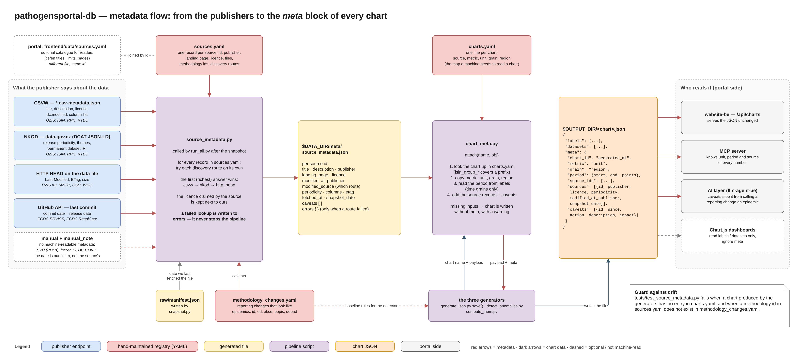

# Metadata — what the numbers mean

A generated chart JSON is only `labels` and `datasets`: bare numbers with Czech labels. A person
reads what they are looking at from the page heading. A machine cannot — and the AI layer on top
of the portal, which is supposed to answer "how many cases were there", must know the metric, the
**unit** and the period of every series. Otherwise it adds percentages to counts, or reports a
change in the reporting channel as an epidemic.

The metadata flow supplies this. It ends as a `meta` block inside every generated JSON file.



## The three registries

All three are YAML files in the repository root, maintained by hand.

| File | One record per | Answers |
|---|---|---|
| `sources.yaml` | source | Where is the publisher's metadata? Which files does the source produce? |
| `charts.yaml` | chart | Which source, metric, unit, grain and region? |
| `methodology_changes.yaml` | reporting change | What changed in how cases are reported, since when, with what effect? |

### `sources.yaml`

```yaml
- id: uzis-isin
  publisher: "ÚZIS ČR"
  landing: "https://www.nzip.cz/data/2621-infekcni-nemoci-otevrena-data"
  licence:
    name: "volný přístup (otevřená data ÚZIS)"
    url: "https://data.gov.cz/podmínky-užití/volný-přístup/"
  files: ["isin/isin_infekcni_nemoci.csv"]
  methodology: ["isin-horizont-2025-12", "zoster-vykazovani-2025-07"]
  discovery:
    csvw: "https://…/Otevrena-data-NR-27-01-infekcni-nemoci.csv-metadata.json"
    nkod: "https://data.gov.cz/zdroj/datové-sady/00024341/c117b2588a0d1ffb022f9d63912e9663"
    http_head: "https://…/Otevrena-data-NR-27-01-infekcni-nemoci.csv"
```

| Key | Meaning |
|---|---|
| `id` | stable identifier; the same id is used in `charts.yaml` and in the portal's catalogue |
| `publisher` | the publisher, named the way it names itself |
| `landing` | a page for a human, not a file |
| `licence` | written the way the source states it; `neuvedena` ("not stated") when it states none |
| `files` | paths relative to `$DATA_DIR`; used to look up the snapshot date |
| `methodology` | ids of records in `methodology_changes.yaml` that concern this source |
| `discovery` | how to find the metadata — see the next section |

> **Do not confuse it with the portal's file of the same name.**
> `pathogensportal/frontend/data/sources.yaml` is the *editorial* description for readers (Czech
> and English titles, what the data cannot tell you, which pages use it). The file here is the
> *technical* provenance. The two share only `id` and `publisher`, and `id` is how they are
> joined.

### `charts.yaml`

```yaml
isin_monthly_trend:      { source: uzis-isin, metric: cases, unit: count, grain: month, region: CZ }
isin_regional_incidence: { source: [uzis-isin, csu-population], metric: cases, unit: per_100k, grain: region, region: NUTS3 }
isin_group_*:            { source: uzis-isin, metric: cases, unit: count, grain: year, region: CZ }
```

| Key | Values |
|---|---|
| `source` | an id from `sources.yaml`, or a list when the chart combines sources |
| `metric` | `cases`, `deaths`, `tests`, `hospitalizations`, `lab_detections`, `positivity`, `case_fatality`, `hospitalization_rate`, `forecast`, `intensity_threshold`, `anomaly_score` |
| `unit` | `count`, `per_100k`, `percent`, `score` — the machine-readable unit |
| `grain` | what the X axis is: `day`, `week`, `month`, `year`, `age_group`, `region`, `vaccination_status`, `cumulative`, `season_week` |
| `region` | `CZ` = one number for the whole country; `NUTS3` = broken down by region |

A key ending in `*` covers every chart with that prefix.

### `methodology_changes.yaml`

A change in how cases are reported looks exactly like an epidemic in the data. This registry
records such changes. It has two consumers: the anomaly detector uses it to mask baselines, and
the metadata flow turns its records into chart caveats. See
[analytics/anomaly-detection.md](analytics/anomaly-detection.md#registry-of-methodology-changes)
for the record format.

The keys (`od`, `do`, `akce`, `rozsah`, `zdroj`, `popis`, `dopad`) and the free-text values are
Czech. The code reads the keys by name and copies the texts into the generated JSON, so
translating them changes the pipeline's output.

## Step 1 — collecting what the publishers say

`scripts/source_metadata.py` reads `sources.yaml` and writes
`$DATA_DIR/meta/source_metadata.json`. `run_all.py` calls it after the snapshot, because it needs
the manifest.

```bash
python scripts/source_metadata.py              # all sources
python scripts/source_metadata.py uzis-isin    # only the listed ones
```

Four discovery routes exist. Each key under `discovery` is tried on its own.

| Route | What it returns | Who has it |
|---|---|---|
| `csvw` | title, description, publisher, licence, `dc:modified`, column list — from the W3C CSVW file `*.csv-metadata.json` next to the CSV | ÚZIS: ISIN, RPN, RTBC |
| `nkod` | release periodicity, themes, permanent dataset IRI — from the Czech National Open Data Catalogue (DCAT, JSON-LD) | ÚZIS: ISIN, RPN, RTBC |
| `http_head` | `Last-Modified`, `ETag`, size, media type | ÚZIS, MZČR, ČSÚ, WHO |
| `github` | date of the last commit | ECDC ERVISS, ECDC RespiCast |

Sources with no machine-readable metadata — the SZÚ PDFs at changing URLs, and the frozen ECDC
COVID-19 series — have `manual: <date>` with a mandatory `manual_note`, so that it is clear the
date is our claim and not the publisher's.

Rules the collector follows:

- **The richest answer wins.** Routes are listed from the most precise one (`csvw` → `nkod` →
  `http_head`), and an earlier value is never overwritten by a later one. The CSVW date therefore
  beats `Last-Modified`, which for large files tends to be the date of the last regeneration, not
  the date of new data. `modified_source` records which route supplied the date.
- **The source's own licence claim is kept.** When the CSVW file states a licence URL that differs
  from the one in the registry, it is stored as `licence.url_claimed_by_source`.
- **Our own record is added.** `snapshot_date` — the day we last archived a changed file of this
  source — comes from `raw/manifest.json`.
- **Caveats are looked up, not copied.** For each id under `methodology`, the description and the
  impact are taken from `methodology_changes.yaml`.
- **A failure never stops the pipeline.** When a publisher does not answer, the error is written
  into the source's `errors` field and the run continues. The opposite would mean the portal loses
  data because a label could not be fetched. The script exits with a non-zero code only when
  *every* source failed.

One record of the output:

```jsonc
"uzis-isin": {
  "id": "uzis-isin",
  "publisher": "ÚZIS ČR",
  "landing_page": "https://www.nzip.cz/data/2621-infekcni-nemoci-otevrena-data",
  "licence": { "name": "…", "url": "…" },
  "files": ["isin/isin_infekcni_nemoci.csv"],
  "fetched_at": "2026-09-24T06:00:12Z",
  "title": "…", "description": "…", "columns": ["rok", "mesic", "…"],
  "modified_at_publisher": "2026-01-22T09:09:17Z",
  "modified_source": "csvw",
  "periodicity": "annual",
  "catalog_iri": "https://data.gov.cz/zdroj/datové-sady/…",
  "snapshot_date": "2026-09-01",
  "caveats": [ { "id": "zoster-vykazovani-2025-07", "since": "2025-07", "action": "break",
                 "description": "…", "impact": "…" } ]
}
```

## Step 2 — attaching `meta` to a chart

`scripts/chart_meta.py` is shared by all three generators. `attach(name, obj)` returns a copy of
the chart with a `meta` block:

1. Look the chart up in `charts.yaml` (exact name first, then a `*` prefix).
2. Copy `metric`, `unit`, `grain` and `region`.
3. For time grains (`day`, `week`, `month`, `year`), read the period from the first and the last
   label. For an age or region axis this is skipped — "from 0–4 to 80+" would look like a data
   range.
4. For every source id, add the record from `source_metadata.json` and collect its caveats. A
   caveat that arrives from several sources appears once.

```jsonc
"meta": {
  "chart_id": "isin_monthly_trend",
  "metric": "cases", "unit": "count", "grain": "month", "region": "CZ",
  "generated_at": "2026-09-24T06:03:41Z",
  "source_ids": ["uzis-isin"],
  "period": { "start": "2018-01", "end": "2025-12", "points": 96 },
  "sources": [ { "id": "uzis-isin", "title": "…", "publisher": "ÚZIS ČR", "landing_page": "…",
                 "licence": { "…": "" }, "modified_at_publisher": "2026-01-22T09:09:17Z",
                 "periodicity": "annual", "fetched_at": "…", "snapshot_date": "2026-09-01" } ],
  "caveats": [ { "id": "zoster-vykazovani-2025-07", "since": "2025-07", "action": "break",
                 "description": "…", "impact": "…" } ]
}
```

Both inputs are optional. Without `charts.yaml` or `source_metadata.json` the charts are still
generated, only without `meta` or without the `sources` part.

## Who reads `meta`

| Consumer | Uses |
|---|---|
| the portal's `/api/charts` | serves the JSON unchanged, `meta` included |
| the MCP server and the AI layer | unit, period, source, freshness, caveats |
| Chart.js on the dashboards | nothing — it reads only `labels` and `datasets` |

## Keeping the registries honest

`tests/test_source_metadata.py` guards the places where the registries could quietly fall behind
the code:

- every chart the generators produce must have an entry in `charts.yaml`;
- every `methodology` id in `sources.yaml` must exist in `methodology_changes.yaml` — a typo would
  otherwise silently drop a caveat;
- an unreachable publisher must end up in `errors` without affecting the other sources;
- a chart without an entry must still be generated.

## Adding or changing things

| You are… | Do this |
|---|---|
| adding a chart | add one line to `charts.yaml` |
| adding a source | add a record to `sources.yaml`; use the same `id` in the portal's catalogue |
| recording a reporting change | add a record to `methodology_changes.yaml` and list its `id` under `methodology` of the affected source |
